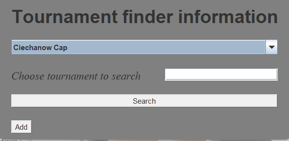

# Chess-search-application
The project aims to search for information about chess, including chess tournaments, players, and judges. It has been implemented in Java, with Hibernate being responsible for the database layer. The GUI and Hibernate aspects of the project are focused on the following classes: Person, Player, Judge, PlayerJudge, Man, Woman, PlayerCategory, ChessCategory, Tournament, Address, and PointsForPlace. 
Please find below the project documentation along with a link to access the Graphical User Interface (GUI) representation.

[GUI representation video link](https://youtu.be/uebZdsUk9zw)

Documentation:

#
# A system for searching information about chess tournaments, players, and judges.

# Contents

1. **[General information](#1st)**
   1. Problem domain
   2. Objective
   3. System Scope of Responsibility
   4. System Users
   5. User Requirements
   6. Non-functional Requirements - Metrics
   7. Description of Future System Evolution
   8. Glossary of Domain Terms

**2. [Use Case Diagram](#2nd)**

**3. [Class Diagram - Analytical](#3rd)**

**4. [Class Diagram - Design](#4th)**

**5. [Textual Use Case Scenario Description: "Add Tournament"](#5th)**

**6. [Activity Diagram for Use Case "Add Tournament"](#6th)**

**7. [State Diagram for Class Tournament](#7th)**

**8. [Interaction (Sequence) Diagram for Use Case „Add Tournament"](#8th)**

**9. [GUI Desing](#9th)**

**10. [Discussion of Design Decisions and the Consequences of Dynamic Analysis](#10th)**

---
<a name="1st"><h1>1. General information</h1></a>

### i. Problem domain

Due to the recent surge in popularity of chess, there is a need for creating a system that would enable the search for information regarding chess tournaments, top players and judges.

### ii. Objective

The objective is to develop a system that enables users to search, add, and view detailed information about players, judges and tournaments. Additionally, the system should ensure the storage of this data and present it on the screen at selected moments.

### iii. System Scope of Responsibility

The system should enable the management of data related to:

- Individuals associated with chess (players, judge)
- Chess tournaments along with their addresses
- Chess openings
- Chess categories
- Rules of various chess modes

Proper access to individual data and their aggregations must be ensured. The system does not support tournament management in any way. Therefore, a separate system should be developed for that purpose.

### iv. System Users

The system will be utilized by players (including judges), the Polish Chess Federation (PZSZACH), and all unregistered guests interested in chess.

### v. User Requirements

Part l

- The system should store information about Players and Judges, including their first name, last name, middle name (if applicable), gender (female or male). Additionally, for Players, their ranking (a natural number greater than 800) should be stored, while for Judges, the year of starting judging, years of experience, and minimum fee in PLN (currently set at 20, subject to change) should be included. It is possible for a Judge to also be a Player. This is a complete division.
- The system should allow the storage of chess category information for individuals who possess it. The acquisition of a specific chess category should be confirmed by including the date of attainment.
- The name of each chess category should be recorded.
- For each tournament, its name, start and end dates, prize money (minimum 10,000 PLN), and address should be stored. Tournaments are always supervised by a single Judge. Each tournament follows specific rules, including the time allocated for each game and the increment after each move (which can be 0 or higher).
- Different ranking points are awarded based on the ranking and tournament placement.
- Each game involves two chess players. The outcome of the game (victory for white/black, draw) as well as the game record are important. For each game, chess openings are recorded, including the name and description.

Part ll

- Displaying information about Players, Judges (Player, Judge, Guest).
- Displaying the progress of a game (Player, Judge, Guest).
- Adding a new tournament (Polish Chess Federation - PZSZACH).
- Displaying a list of chess openings and chess category lists (Player, Judge, Guest).
- Viewing the history of acquired chess categories (Player).
- Assigning a Judge to a tournament (PZSZACH).
- Adding a new Player or Judge (PZSZACH).

Part lll

- Intuitiveness, clarity, and ease of use.
- Accessibility and proper functioning of system features across different external devices.
- Ability to support concurrent usage by multiple users.
- Prompt system response to user actions.

Non-functional requirements for the system:

- Availability
- Ability to handle multiple concurrent users.
- Reliability
- Data storage in a database
- Ensuring data security.

### vi. Non-functional Requirements - Metrics

| Constraint | Measurement |
| --- | --- |
| Availability | The system should be available to users 24/7/365 (24 hours a day, 7 days a week, 365 days a year). |
| Ability to handle multiple concurrent users | The system should support and handle 2500 concurrent users simultaneously, regardless of user type (logged in or not). |
| Reliability | The average system uptime should be at least 3 years without any failures. |
| Data storage in a database | The database server should be h2-2.1.212 (or newer). |
| Ensuring data security | Creation of backups according to a schedule, transactional data processing. |

### vii. Description of Future System Evolution

In the future, there are plans to expand the system by incorporating a tournament management system, allowing for the organization and facilitation of chess tournaments. Additionally, there will be a feature to browse detailed information about individual games, including the ability to view the progress and moves made during each game.

### viii. Glossary of Domain Terms

| Term | Explanation |
| --- | --- |
| Guest | A user whose data is not registered in the system. Guests have access to all visual functionalities of the system. |
| Player | A chess player who participates in chess-related activities. Players also have access to all functionalities of the system. |
| Judge | A professional judge affiliated with the Polish Chess Federation (PZSZACH). Judges also have access to all functionalities of the system. |
| Chess tournament | A competition held at a specific location and time, involving one judge and multiple players. |
| Chess category | A chess title that players acquire as they progress in their professional careers. |
| Chess opening | The initial sequence of moves in a chess game, with specific names assigned to them. |
| Chess modes | Different types of chess games that vary in terms of time limits for players and added time per move. |
| PZSZACH | Polish Chess Federation. |
---
<a name="2nd"><h1>2. Use Case Diagram</h1></a>

---
<a name="3rd"><h1>3. Class Diagram - Analytical</h1></a>

---
<a name="4th"><h1>4. Class Diagram - Design</h1></a>

---
<a name="5th"><h1>5. Textual Use Case Scenario Description: "Add Tournament"</h1></a>

This section provides a textual description of the use case scenario for adding a new tournament.

After clicking the "Add" button in the tournament information display view, PZSZACH is redirected to a new window where they can manually enter the details of the new tournament. This includes the tournament name, address (country, city, street, building number, and optionally apartment number), start and end dates, prize amount, and the judge responsible for the tournament. Upon confirmation, if all the information is correct, a message is displayed confirming the successful addition of the new tournament to the database, and the user is returned to the previous window.

---
<a name="6th"><h1>6. Activity Diagram for Use Case "Add Tournament"</h1></a>

---
<a name="7th"><h1>7. State Diagram for Class Tournament</h1></a>

---
<a name="8th"><h1>8. Interaction (Sequence) Diagram for Use Case „Add Tournament"</h1></a>

---
<a name="9th"><h1>9. GUI Desing</h1></a>

Main Screen

Tournaments Search Screen

Tournament Addition Form

Successful Tournament Addition Message

Tournament Information Display

Message for Duplicate Tournament Name

Message for Invalid Start and End Dates

Message for Missing Data in the Form

Players and Judges Search Screen

---
<a name="10th"><h1>10. Discussion of Design Decisions and the Consequences of Dynamic Analysis</h1></a>

The analytical class diagram includes constructs that do not exist in the Java programming language, in which the system will be implemented. In the design class diagram, these constructs have been transformed as follows:

• Multiple inheritance, overlapping - An interface has been added to the Player class. This allows the PlayerJudge class to inherit from Judge and implement the Player interface, enabling a situation where a person can be both a player and a judge.

• Disjoint inheritance - Disjoint inheritance has been implemented between Person and Gender using separate classes, Man and Woman. In the program, we assume that a person can be either male or female, but not both simultaneously.

• Qualified association - A field of type Map\<String, Tournament\> has been added to the Judge class to facilitate quick and easy lookup of tournaments that a specific judge has officiated.

• Association with attribute - A mediator class and two 1 - \* associations have been established between Player and ChessCategory. This solution is intuitive and relatively simple to implement.

• Composition - The inner class PointsForPlace has been introduced within the Tournament class. This is a natural solution that is easy to understand and implement. Points for a specific tournament cannot exist without a corresponding tournament.

Regular associations have been implemented using collections, while finite sets of values have been implemented using enums.
